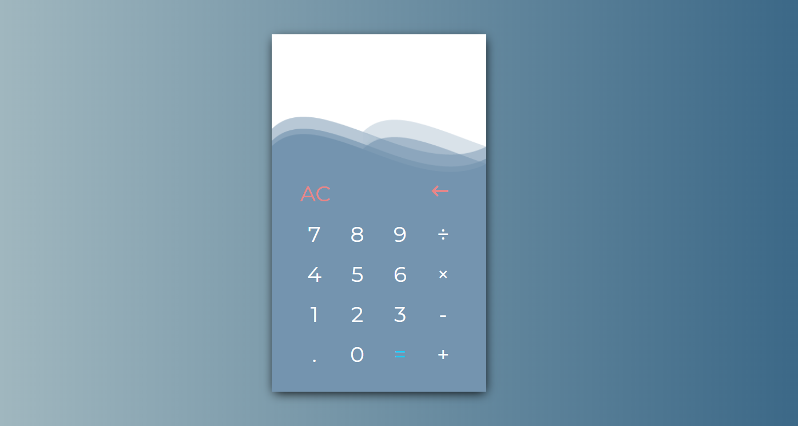

# Calculator
> Calculator with basic abilities

## Table of contents
* [General info](#general-info)
* [Features](#features)
* [Technologies](#technologies)
* [Screenshots](#screenshots)
* [Status](#status)
* [Credit](#credit)

## General info
One of [The Odin Project course assignment](https://www.theodinproject.com/courses/web-development-101/lessons/calculator). Student had to bulid simple calculator with all the basic functions, such as adding, subtracting, multiplying and divideing.

## Screenshots

## Technologies
* CSS / CSS3
* HTML / HTML5
* RWD / Flexbox Grid
* JavaScript / ES6

## Features
Features:
* add
* subtract
* multiply
* divide
* string together several operations such as (12 + 7 - 5 * 3 etc.)
* operations on decimal numbers

## Status
Project is finished

## Credit
[The Odin Project](https://www.theodinproject.com/courses/html5-and-css3/lessons/positioning-and-floating-elements)
